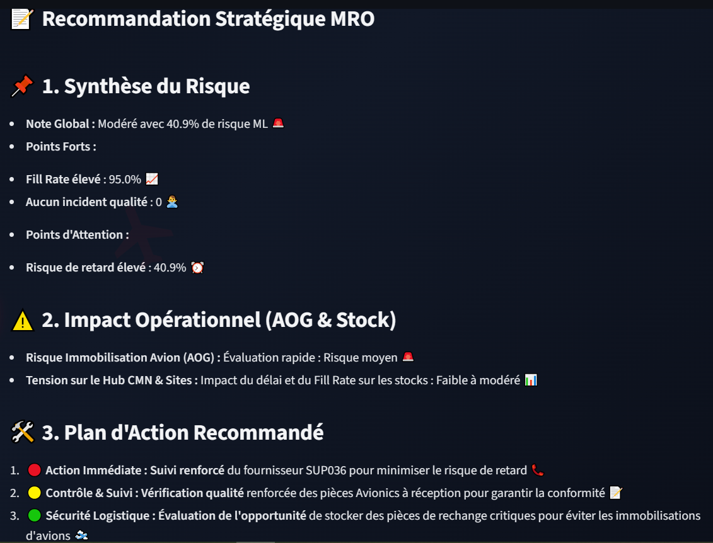

# ✈️ MRO Supply Twin AI


An AI-driven Digital Twin designed for **Maintenance, Repair, and Overhaul (MRO)** aeronautical supply chains. This application predicts component stockout/failure risks using Machine Learning and provides real-time strategic recommendations powered by LLaMA-3 via Groq.

---

## 📸 Screenshots & Demo

| Dashboard & Risk Prediction | AI Copilot (LLaMA-3 via Groq) |
| :---: | :---: |
|  |  |

> *Figure 1: Predictive risk scoring and intelligent agent assistant for MRO supply chain management.*

---

## ✨ Key Features

- **Predictive Risk Scoring:** ML Model (`Scikit-Learn`) forecasting stockout and component failure risks based on flight hours and maintenance logs.
- **AI Supply Chain Copilot:** Integrated LLaMA-3 (via Groq API) acting as a domain-expert decision assistant.
- **Interactive UI:** Built with Streamlit for real-time visualization and parameter tuning.
- **Fully Containerized:** Packaged with Docker for consistent multi-environment deployment.
- **Cloud Ready:** Optimized for deployment on AWS (EC2 / App Runner).

---

## 🏗️ Architecture

```text
[ Raw Data / Parameters ]
          │
          ▼
 [ Scikit-Learn Model ] ──► [ Stockout Risk Score ]
          │                             │
          └───────────┬─────────────────┘
                      ▼
            [ Streamlit Dashboard ] ◄──► [ Groq API (LLaMA-3) ]
                      │
                      ▼
            [ Docker Container ] ──► [ AWS Cloud Deployment ]
🚀 Quickstart Guide
Prerequisites
Docker Desktop installed.

A free Groq API Key.

Running with Docker (Recommended)
Clone the repository:

Bash
git clone [https://github.com/votre-username/MRO-Supply-Twin-AI.git](https://github.com/votre-username/MRO-Supply-Twin-AI.git)
cd MRO-Supply-Twin-AI
Build the Docker Image:

Bash
docker build -t supplytwin-mro:v1 .
Run the Container:

Bash
docker run -d -p 8501:8501 -e GROQ_API_KEY="your_groq_api_key_here" --name supplytwin_app supplytwin-mro:v1
Open http://localhost:8501 in your browser.

📂 Project Structure
Plaintext
.
├── app.py                   # Streamlit UI & Application Logic
├── Dockerfile               # Container build configurations
├── requirements.txt         # Python dependencies
├── models/                  # Trained ML models (.pkl)
├── assets/                  # README Images & Screenshots
└── README.md                # Project Documentation
🎓 Author
Developed by an Engineering Student at École Centrale Casablanca.