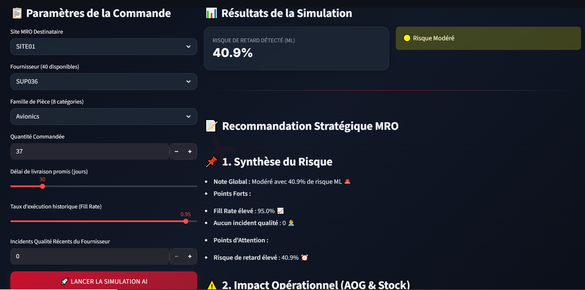
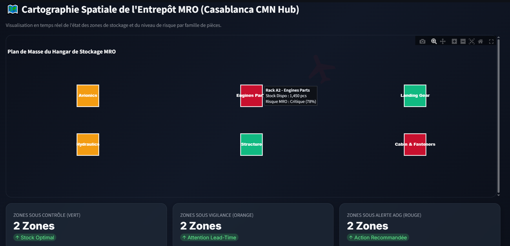
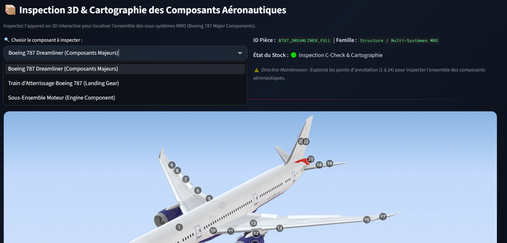

# ✈️ MRO Supply Twin AI — Industry 4.0 Suite


An End-to-End AI-driven Digital Twin designed for **Maintenance, Repair, and Overhaul (MRO)** aeronautical supply chains (Royal Air Maroc - Casablanca CMN Hub). 

This multi-tab application combines **Machine Learning**, **LLM Decision Support (LLaMA-3 via Groq)**, **2D Warehouse Spatial Mapping**, and **3D Interactive Component Inspection**.

---

## 📸 Cockpit Overview & Modules

### 🚀 Tab 1: AI Risk Simulator & Decision Agent
Predicts component stockout and delivery delay risks using Machine Learning (`Scikit-Learn`), combined with an LLM Agent providing structured, real-time operational recommendations for MRO managers.



---

### 🗺️ Tab 2: 2D Digital Twin (Casablanca CMN Warehouse)
Provides real-time spatial mapping of warehouse storage racks and part families, highlighting risk levels (Optimal, Warning, Critical AOG) across storage zones.



---

### 📦 Tab 3: 3D Interactive Component Inspection
Interactive 3D visualization of major aeronautical structures (Boeing 787 components, landing gears, engines) allowing MRO engineers to inspect sub-assemblies and verify stock availability before maintenance operations.



---

## ✨ Key Features

- **Predictive Risk Scoring:** ML Model (`Scikit-Learn`) forecasting delay probabilities based on lead time, ordered quantities, fill rates, supplier history, and quality incidents.
- **AI Supply Chain Copilot:** Integrated LLaMA-3.3-70B (via Groq API) acting as a domain-expert decision assistant with structured action plans.
- **2D Warehouse Digital Twin:** Interactive Plotly map visualizing warehouse rack occupancy and criticality at Casablanca CMN Hub.
- **3D Aeronautical Viewer:** Embedded 3D model inspection for aircraft components (gL TF / Sketchfab integration).
- **Fully Containerized:** Packaged with Docker for seamless deployment across local and cloud environments.
- **Cloud Ready:** Fully containerized with Docker, ready for AWS deployment (EC2 / App Runner / ECS).

---

## 🏗️ Architecture

```text
┌────────────────────────────────────────────────────────────────────────┐
│                        Streamlit Cockpit UI                            │
├────────────────────────┬───────────────────────┬───────────────────────┤
│ Tab 1: ML & AI Agent   │ Tab 2: 2D Digital Twin│ Tab 3: 3D Inspection  │
└───────────┬────────────┴───────────┬───────────┴───────────┬───────────┘
            │                        │                       │
            ▼                        ▼                       ▼
   [ Scikit-Learn ML ]     [ Plotly Spatial Map ]    [ 3D / WebGL Viewer ]
   [ Groq LLaMA-3 Agent]   (Warehouse Racks CMN)     (Boeing 787 Models)
            │
            ▼
   [ Docker Container ] ──► [ AWS Cloud Deployment ]
   ```

## 🌐 Deployment Options

- **Local Execution (Docker):** Fully operational locally via Docker Desktop.
- **Cloud Deployment (AWS EC2):** The application is packaged and prepared for AWS deployment (`Dockerfile` optimized). Instructions for launching on an EC2 instance (`t2.micro` / `t3.micro`) are included in the repository.

🚀 Quickstart Guide
Prerequisites
Docker Desktop installed and running.

A free Groq API Key.

Running with Docker (Recommended)
Clone the repository:

Bash
git clone [https://github.com/votre-username/MRO-Supply-Twin-AI.git](https://github.com/votre-username/MRO-Supply-Twin-AI.git)
cd MRO-Supply-Twin-AI
Build the Docker Image:

Bash
docker build -t supplytwin-mro:v1 .
Run the Container:

Bash
docker run -d -p 8501:8501 -e GROQ_API_KEY="your_groq_api_key_here" --name supplytwin_app supplytwin-mro:v1
Open http://localhost:8501 in your browser.

📂 Project Structure
Plaintext
.
├── app.py                   # Main Streamlit Cockpit Application
├── Dockerfile               # Docker build instructions
├── requirements.txt         # Python dependencies
├── models/                  # Trained ML models (.pkl)
├── data/                    # Processed MRO datasets
├── assets/                  # README Screenshots & Visuals
│   ├── tab1_simulator.png
│   ├── tab2_digital_twin_2d.png
│   └── tab3_3d_inspection.png
└── README.md                # Project Documentation
🎓 Author
Developed as an Engineering Project at École Centrale Casablanca.